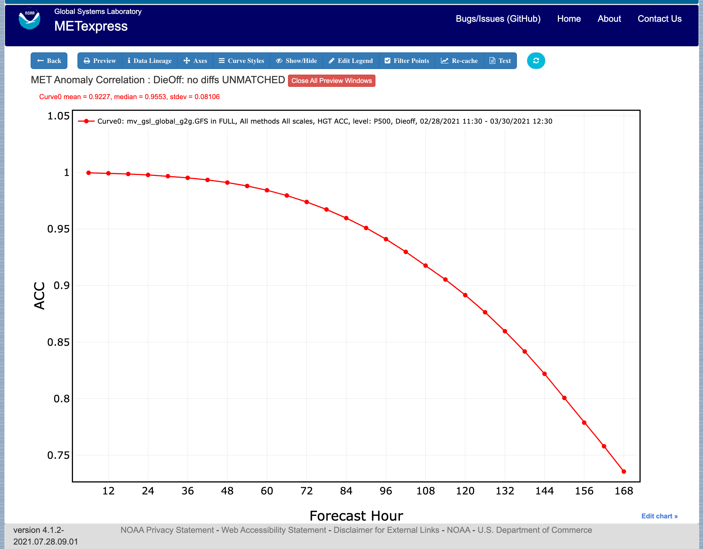
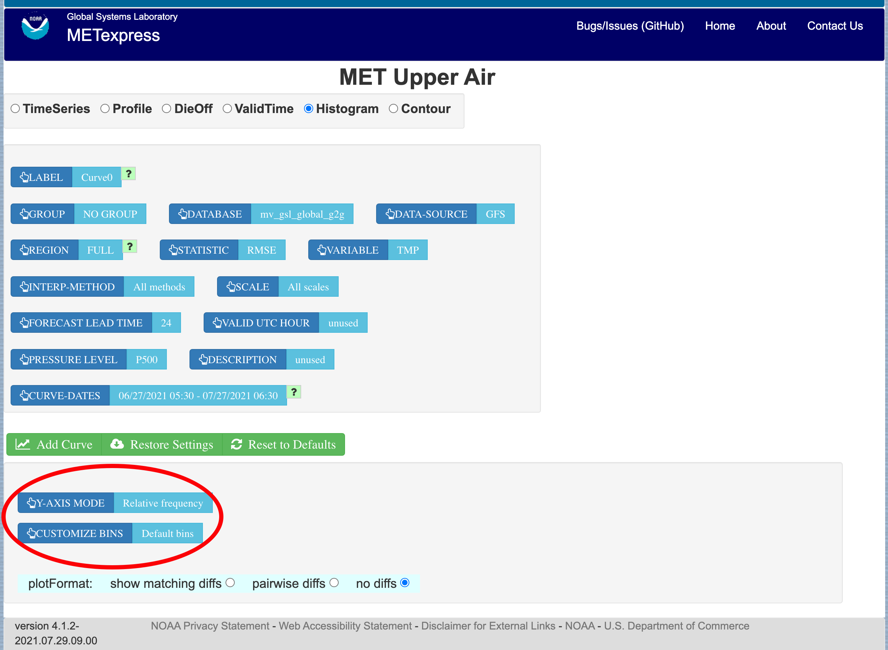
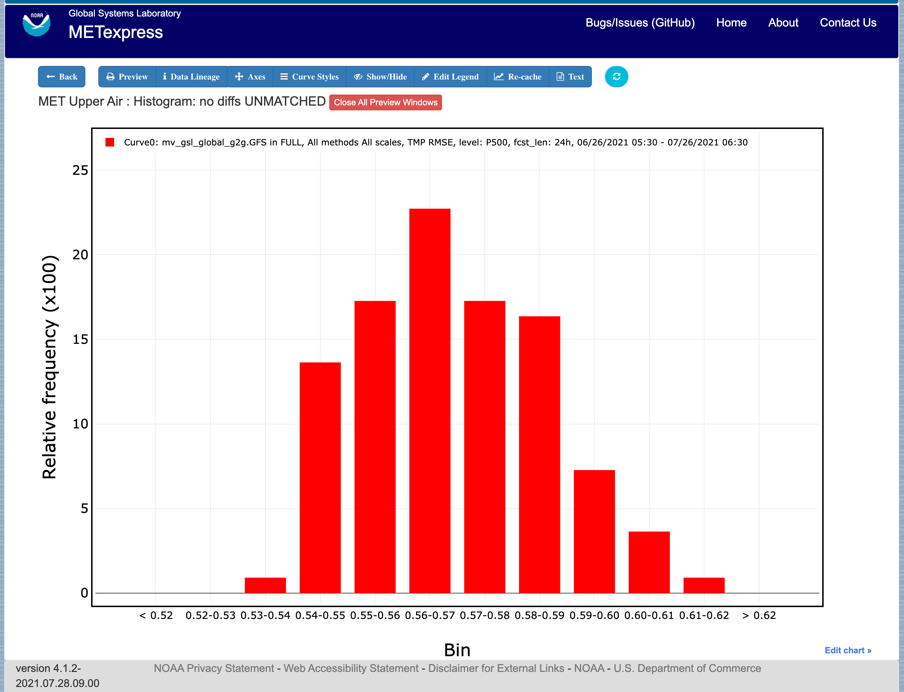
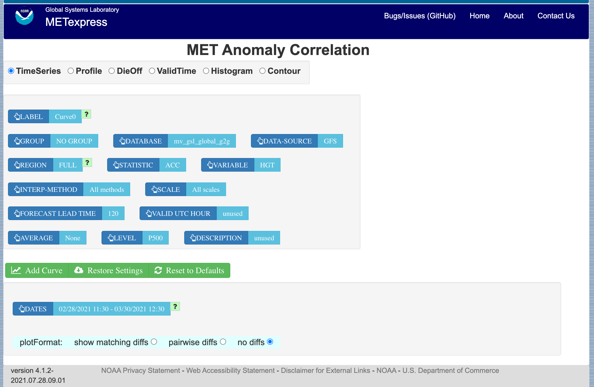
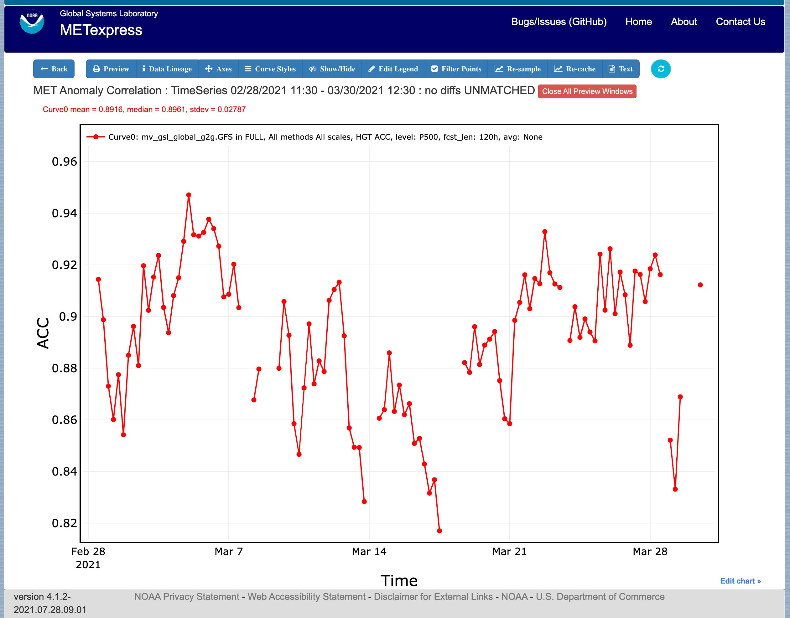
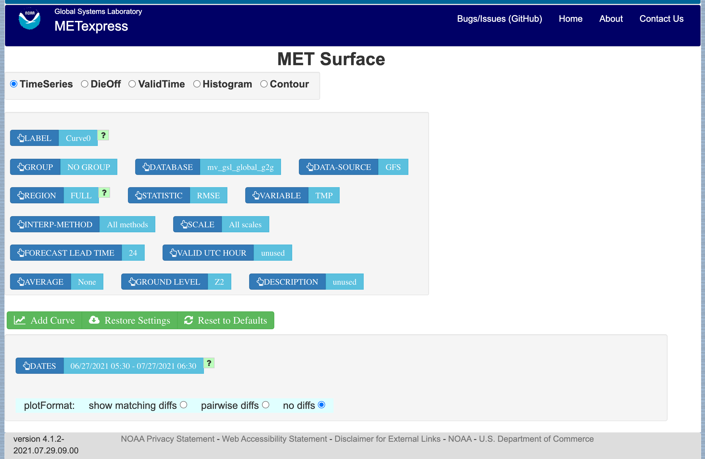
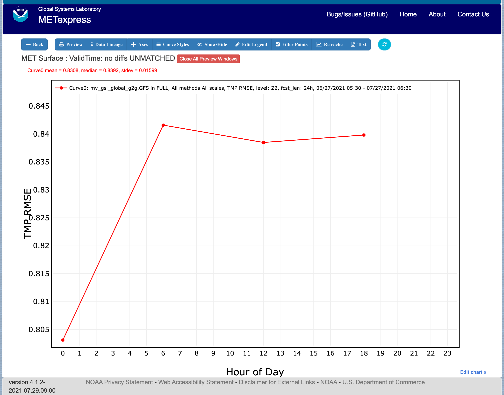
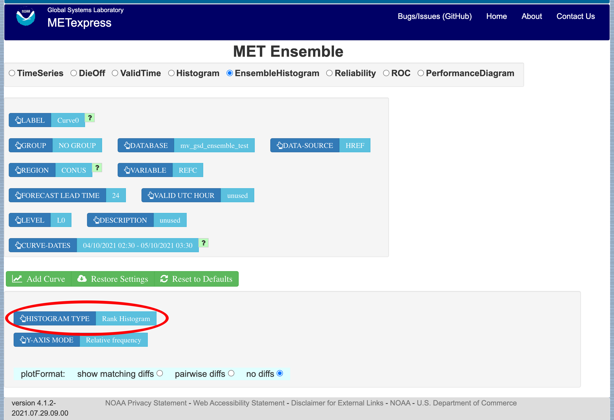
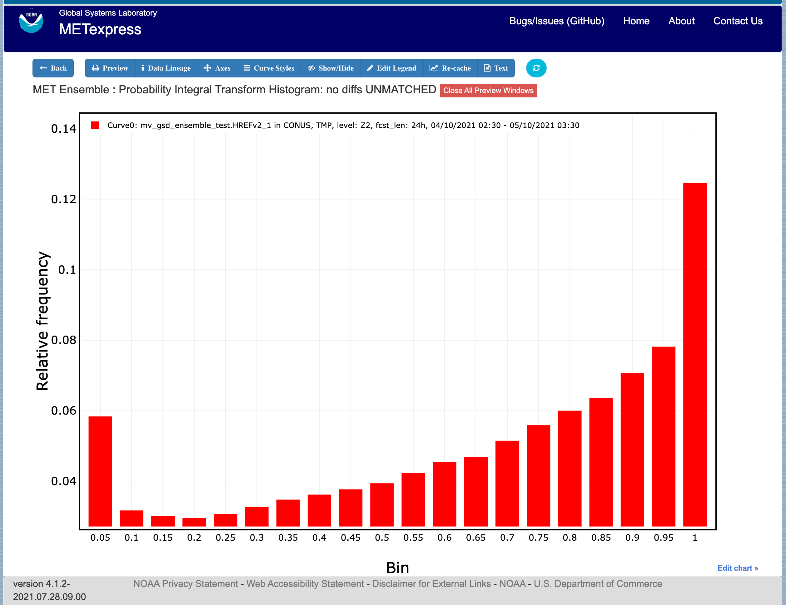
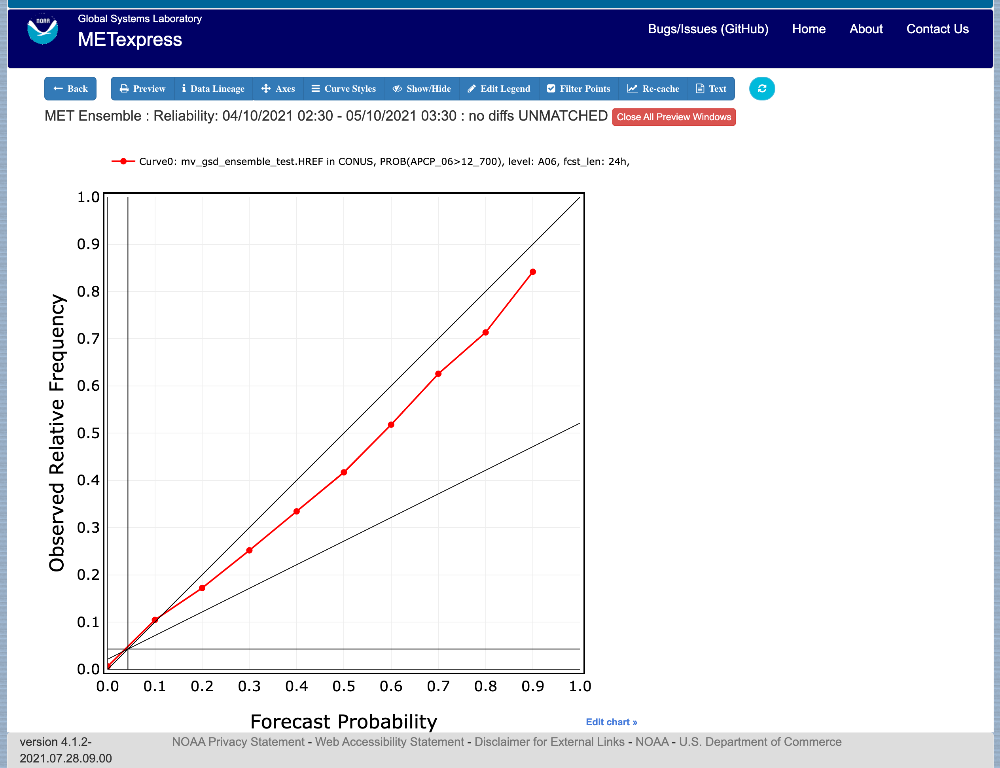

.. _apps:

METexpress Apps
===============

This section includes a description of the unique features of each app.

Upper Air App
_____________

The Upper Air app is designed for plotting scalar and contingency table
statistics at different pressure levels in the atmosphere.

The user interface for Upper Air follows the general description from
above.  Choices specific to this app are shown below.

Choices for Statistic (depending on available line types):

* RMSE
* Bias-corrected RMSE
* MSE
* Bias-corrected MSE
* ME (Additive bias)
* Multiplicative bias
* Forecast mean
* Observed mean
* Forecast stdev
* Observed stdev
* Error stdev
* Pearson Correlation
* Forecast length of mean wind vector
* Observed length of mean wind vector
* Forecast length - observed length of mean wind vector
* abs(Forecast length - observed length of mean wind vector)
* Length of forecast - observed mean wind vector
* abs(Length of forecast - observed mean wind vector)
* Forecast direction of mean wind vector
* Observed direction of mean wind vector
* RMSE of forecast wind vector length
* RMSE of observed wind vector length
* Vector wind speed MSVE
* Vector wind speed RMSVE
* Forecast mean of wind vector length
* Observed mean of wind vector length
* Forecast mean - observed mean of wind vector length
* abs(Forecast mean - observed mean of wind vector length)
* Forecast stdev of wind vector length
* Observed stdev of wind vector length

The Upper Air app includes functionality for these types of plots:

* Time Series
* Profile
* Dieoff
* ValidTime
* Histogram
* Contour

The Upper Air app includes the following plot types.

**Time Series**: The default plot type is Time Series, which has date on
the x-axis and the mean value of the selected parameter for that date on
the y-axis.

**Profile**: The Profile plot type displays pressure level on the y–axis
and the mean value of the selected parameter on the x-axis.  

**Die-off**: Die-off plots show how skill (or the inverse, error)
changes with increasing lead time.  :numref:`apps_interface_dieoff` shows the user
interface page after selecting the plot type of DieOff.  Note that
another selector is included for DIEOFF TYPE, which has the following
possible values:

        1. Dieoff

	2. Dieoff for a specific UTC cycle start time
	
	3. Single cycle forecast

.. _apps_interface_dieoff:

.. figure:: figure/apps_interface_dieoff.png

	    User Interface screen after selecting plot type of DieOff.

:numref:`apps_upper_air_dieoff_plot` shows a sample of a DieOff plot in METexpress.
This looks more
like a familiar die-off curve when plotting skill, such as anomaly
correlation as plotted in :numref:`apps_anom_corr_dieoff_plot` using the Anomaly Correlation
app, rather than error as is plotted with the Upper Air app.  

The option “dieoff” for Dieoff Type uses all data at each given forecast
hour within the specified date range.  The option for “Dieoff for a
specific UTC cycle start time” filters data to only use those at a
specified cycle initialization time, such as 0 or 12.  The option
“Single cycle forecast” uses only the forecasts from the first cycle in
the specified date range.

.. _apps_upper_air_dieoff_plot:

	    
	    Upper Air DieOff plot

.. _apps_anom_corr_dieoff_plot:

	    Anomaly Correlation DieOff plot

**ValidTime**: The ValidTime plot type (also sometimes known as diurnal
cycle plots) displays valid UTC hour on the x–axis and the mean value of
the selected parameter on the y-axis. 

**Histograms**: Histograms allow users to visualize the distribution of
a given statistic over a specified time period. For example, if a user
requested a histogram of RMSE for 144-h GFS forecasts over the global
domain for a month, they would see the frequencies of specific RMSE values
produced by individual GFS runs over that month. Histograms have statistical
value bins on the x-axis, and number or frequency counts on the y-axis.

Histograms have a number of additional selectors that control their appearance:

* Y-axis mode: Can be set to either “Relative frequency” or “Number”, depending
  on whether a user wants the frequency of a given statistic displayed as a
  fraction of 100, or as a raw count.

* Customize bins: With this selector, the user can choose one of the following
  options to customize their x-axis bins:

  * Default bins

  * Set number of bins
 
     * Has sub-selector “Number of bins”
  
  * Make zero a bin bound

  * Choose a bin bound

     * Has sub-selector “Bin pivot value”

  * Set number of bins and make zero a bin bound

     * Has sub-selector “Number of bins”

  * Set number of bins and choose a bin bound

     * Has sub-selectors “Number of bins” and “Bin pivot value”
 
  * Manual bins
 
     * Has sub-selector “Bin bounds”
 
  * Manual start, number, and stride

     * Has sub-selectors “Number of bins”, “Bin start”, and “Bin stride”

:numref:`apps_interface_histogram` shows the user interface for histogram plots
and :numref:`apps_histogram_plot` shows a sample plot.

.. _apps_interface_histogram:

	    
	    The user interface for histogram plots.

.. _apps_histogram_plot:

	    Plot generated from selections in :numref:`apps_interface_histogram`

**Contour**: Contour plots can be used in many ways.  One can illustrate
data with respect to height, as in plots seen at
http://www.emc.ncep.noaa.gov/gmb/STATS_vsdb/,
which have height on the y-axis and forecast hour (as in lead time) on
the x-axis.  These VSDB stat plots can be easily replicated in METexpress
by using the contour plot type, except that the plot in METexpress will have
only one pane, not two. In addition, METexpress users are not bound to have
only pressure level / height on the y-axis or forecast lead time on the x-axis.
They can reverse the two, place valid or init UTC hour on one of the axes,
create Hovmoller diagrams, and many other combinations.

Contour plots have two additional selectors, x-axis-parameter and
y-axis-parameter. With these, a user can decide which field to place on
the x-axis (e.g. forecast lead time), and which to place on the y-axis
(e.g. pressure level or valid UTC hour).

:numref:`apps_upper_air_contour_plot` shows an example of an Upper Air profile plotted as a contour plot.

.. _apps_upper_air_contour_plot:

 
	    Upper Air profile, as a contour plot

Anomaly Correlation App
_______________________

The Anomaly Correlation app is designed for plotting anomaly correlations
at different pressure levels in the atmosphere, and at different heights above the ground.

An example of the Anomaly Correlation app user interface is shown in :numref:`apps_interface_anom_corr`
This interface is similar to the one for Upper Air but has fewer selectable parameters.

.. _apps_interface_anom_corr:

 
	    Anomaly Correlation app user interface

In this application, the selectable values are derived from the data for these parameters:

* Group
* Database
* Data-Source
* Region
* Statistic
* Variable
* Interp-Method
* Scale
* Forecast lead time
* Level
* Description
* Dates
* Curve-dates

The selector for the Statistic has these possible choices (depending on available MET line types):

* ACC
* Vector ACC

Plot types available include 

* Time Series
* Profile
* DieOff
* ValidTime
* Histogram
* Contour

All plot types function the same here as they do in MET Upper Air described above.
A sample anomaly correlation plot is shown in :numref:`apps_anom_corr_sample_plot`.

.. _apps_anom_corr_sample_plot:

	    Anomaly Correlation sample plot.
 
Surface App
___________

The Surface app is designed for plotting scalar and contingency table 
statistics at different heights above the ground. 

The user interface for the Surface app is shown in :numref:`apps_interface_surface`.

.. _apps_interface_surface:

	    User Interface for the Surface app

For this app, the following parameters have choices derived from the data.

* Group
* Database
* Data-source
* Region
* Statistic
* Variable
* Interp-Method
* Scale
* Forecast lead time
* Ground level
* Description
* Dates
* Curve-dates

The selector for the Statistic has these possible choices (depending on available MET line types):

* RMSE
* Bias-corrected RMSE
* MSE
* Bias-corrected MSE
* ME (Additive bias)
* Multiplicative bias
* Forecast mean
* Observed mean
* Forecast stdev
* Observed stdev
* Error stdev
* Pearson Correlation
* Forecast length of mean wind vector
* Observed length of mean wind vector
* Forecast length - observed length of mean wind vector
* abs(Forecast length - observed length of mean wind vector)
* Length of forecast - observed mean wind vector
* abs(Length of forecast - observed mean wind vector)
* Forecast direction of mean wind vector
* Observed direction of mean wind vector
* RMSE of forecast wind vector length
* RMSE of observed wind vector length
* Vector wind speed MSVE
* Vector wind speed RMSVE
* Forecast mean of wind vector length
* Observed mean of wind vector length
* Forecast mean - observed mean of wind vector length
* abs(Forecast mean - observed mean of wind vector length)
* Forecast stdev of wind vector length
* Observed stdev of wind vector length

Plot types available include:

* Time Series
* DieOff
* ValidTime
* Histogram
* Contour

Plots in the Surface app for Time Series, DieOff, ValidTime, Histogram, and
Contour are the same as in Upper Air. An example of a Valid Time plot
is shown in :numref:`apps_surface_plot`.

.. _apps_surface_plot:

	    Surface app ValidTime plot
 
Air Quality App
_______________

Similarly to the Surface app, the Air Quality app is designed for plotting scalar and contingency table 
statistics at different heights above the ground, but with a focus on variables related to air quality. 

For this app, the following parameters have choices derived from the data.

* Group
* Database
* Data-source
* Region
* Statistic
* Variable
* Threshold
* Interp-Method
* Scale
* Forecast lead time
* Ground level
* Description
* Dates
* Curve-dates

The selector for the Statistic has these possible choices (depending on available MET line types):

* CSI
* FAR
* FBIAS
* GSS
* HSS
* PODy
* PODn
* POFD
* RMSE
* Bias-corrected RMSE
* MSE
* Bias-corrected MSE
* ME (Additive bias)
* Multiplicative bias
* Forecast mean
* Observed mean
* Forecast stdev
* Observed stdev
* Error stdev
* Pearson Correlation

Plot types available include 

* Time Series
* DieOff
* Threshold
* ValidTime
* Histogram
* Contour

Plots in the Air Quality app for Time Series, DieOff, ValidTime,
Histogram, and Contour are the same as in Upper Air. 

An additional plot type, Threshold, is available in this app.
Threshold plots display threshold on the x-axis, and the mean value
of the selected parameter on the y-axis.
	    
:numref:`apps_air_qual_thresh_plot` shows an example of an Air Quality Threshold plot. 

.. _apps_air_qual_thresh_plot:

	    Air Quality app Threshold plot
 
Ensemble App
____________

The Ensemble app is designed for plotting scalar and contingency table 
statistics, as well as ensemble metrics, for multi-member ensemble model runs. 

For this app, the following parameters have choices derived from the data.

* Group
* Database
* Data-source
* Region
* Statistic
* Variable
* Forecast lead time
* Level
* Description
* Dates
* Curve-dates

The selector for the Statistic has these possible choices (depending on available MET line types):

* RMSE
* RMSE with obs error
* Spread
* Spread with obs error
* ME (Additive bias)
* ME with obs error
* CRPS
* CRPSS
* MAE
* ACC
* BS
* BSS
* BS reliability
* BS resolution
* BS uncertainty
* BS lower confidence limit
* BS upper confidence limit
* ROC AUC
* EV
* FSS
  
Plot types available include 

* Time Series
* DieOff
* ValidTime
* Histogram
* Ensemble Histogram
* Reliability
* ROC
* Performance Diagram

Plots in the Ensemble app for Time Series, DieOff, ValidTime, and
Histogram are the same as in Upper Air. 

Four plot types are specific to this app: Ensemble Histogram,
Reliability, ROC, and Performance Diagram.

Ensemble Histograms are controlled by the Histogram type selector
that appears at the bottom of the main app page when the plot type
of Ensemble Histogram is selected.  This can be set to Rank
Histogram, Probability Integral Transform Histogram, or Relative
Position Histogram. Selecting one of these will produce the
corresponding plot, with bins pre-calculated in the MET
verification process. As with regular histogram plots, the user
has the option of setting the Y-axis mode to either “Relative frequency”
or “Number”.

Reliability plots produce a single curve for the chosen parameters
(probabilistic variables only), with Forecast Probability on the
x-axis, and Observed Relative Frequency on the y-axis. Four additional
lines will be displayed on the graph, denoting perfect skill, no skill,
x climatology, and y climatology.

ROC plots can display multiple curves (probabilistic variables only),
with False Alarm Rate on the x-axis, and Probability of Detection on
the y-axis. An additional diagonal line will be displayed on the graph,
denoting no skill.

Performance Diagrams can also display multiple curves (probabilistic variables only),
with Success Ratio (1-FAR) on the x-axis, and Probability of Detection on
the y-axis. Additional solid black curves are displayed on the graph to denote lines of constant bias,
and additional dashed black curves are displayed on the graph to denote lines of constant CSI.

:numref:`apps_interface_ens_hist` shows the user interface for defining an Ensemble
Histogram and :numref:`apps_ens_hist_plot_rank_hist` through :numref:`apps_ens_hist_plot_rel_pos_hist` show
examples of the 3 types of Ensemble Histograms.

.. _apps_interface_ens_hist:

	    The Ensemble app user interface for Ensemble
	    Histogram plots.  Note the selector for Histogram Type which
	    is unique to this plot type.

.. _apps_ens_hist_plot_rank_hist:

	    Ensemble Histogram plot type with Histogram Type
	    of Rank Histogram.

.. _apps_ens_hist_plot_pith:

	    Ensemble Histogram plot type with Histogram Type
	    of Probability Integral Transform Histogram.

.. _apps_ens_hist_plot_rel_pos_hist:

	    Ensemble Histogram plot type with Histogram
	    Type of Relative Position Histogram

:numref:`apps_ens_reliability_plot` shows an example Reliability plot,
:numref:`apps_ens_roc_plot` shows an example ROC plot, and
:numref:`apps_ens_perf_diag` shows an example Performance Diagram,
all for the same data set.

.. _apps_ens_reliability_plot:

	    Ensemble app Reliability plot.
	    The 1:1 diagonal gray line represents
	    perfect skill between forecast probability and observation
	    frequency. The diagonal line with the lower slope indicates
	    the point above which the forecast becomes more skillful
	    than climatology, and the vertical and horizontal lines
	    indicate climatology.

.. _apps_ens_roc_plot:

.. figure:: figure/apps_ens_roc_plot.png

	    Ensemble app ROC plot for the same data
	    set defined in :numref:`apps_ens_reliability_plot`.

.. apps_ens_perf_diag:

	    Ensemble app Performance Diagram for the same data
	    set defined in :numref:`apps_ens_reliability_plot`.

Precipitation App
_________________

The Precipitation app is designed for plotting scalar and contingency table
statistics for variables relating to precipitation.

For this app, the following parameters have choices derived from the data.

* Group
* Database
* Data-source
* Region
* Statistic
* Variable
* Threshold
* Interp-Method
* Scale
* Obs type
* Forecast lead time
* Level
* Description
* Dates
* Curve-dates

The selector for the Statistic has these possible choices (depending on available MET line types):

* CSI
* FAR
* FBIAS
* GSS
* HSS
* PODy
* PODn
* POFD
* FSS
* RMSE
* Bias-corrected RMSE
* MSE
* Bias-corrected MSE
* ME (Additive bias)
* Multiplicative bias
* Forecast mean
* Observed mean
* Forecast stdev
* Observed stdev
* Error stdev
* Pearson Correlation

Plot types available include 

* Time Series
* DieOff
* Threshold
* ValidTime
* GridScale
* Histogram
* Contour

Plots in the Precipitation app for Time Series, DieOff,
ValidTime, Histogram, and Contour are the same as in Upper Air. 

A different plot type, Threshold, is present in this app. Threshold
plots display threshold on the x-axis, and the mean value of the
selected parameter on the y-axis.

Another unique plot type, GridScale, is included in this app.
GridScale plots display grid scale on the x-axis, and the mean value
of the selected parameter on the y-axis.

:numref:`apps_interface_thresh_precip` shows an example of the user interface for the
Precipitation app, :numref:`apps_thresh_plot_precip` shows an example Threshold plot, and
:numref:`apps_gridscale_plot_precip` shows an example GridScale plot.

.. _apps_interface_thresh_precip:

	    User interface screen for a Threshold plot
	    in the Precipitation app

.. _apps_thresh_plot_precip:

.. figure:: figure/apps_thresh_plot_precip.png

	    Threshold plot in the Precipitation
	    app produced from selections in :numref:`apps_interface_thresh_precip`

.. _apps_gridscale_plot_precip:

	    GridScale plot in the Precipitation app
	    produced from selections in :numref:`apps_interface_thresh_precip` 
 
Cyclone App
_________________

The Cyclone app is designed for plotting track and intensity verification
statistics for both tropical and extratropical cyclones.

For this app, the following parameters have choices derived from the data.

* Group
* Database
* Data-source
* Basin
* Statistic
* Year
* Storm
* Truth
* Forecast lead time
* Storm classification
* Description
* Dates
* Curve-dates

The selector for the Statistic has these possible choices (depending on available MET line types):

* Track error
* X error
* Y error
* Along track error
* Cross track error
* Model distance to land
* Truth distance to land
* Model-truth distance to land
* Model MSLP
* Truth MSLP
* Model-truth MSLP
* Model maximum wind speed
* Truth maximum wind speed
* Model-truth maximum wind speed
* Model radius of maximum winds
* Truth radius of maximum winds
* Model-truth radius of maximum winds
* Model eye diameter
* Truth eye diameter
* Model-truth eye diameter
* Model storm speed
* Truth storm speed
* Model-truth storm speed
* Model storm direction
* Truth storm direction
* Model-truth storm direction
* RI start hour
* RI end hour
* RI time duration
* RI end model max wind speed
* RI start truth max wind speed
* RI end truth max wind speed
* RI truth start to end change in max wind speed
* RI truth maximum change in max wind speed

Plot types available include

* Time Series
* DieOff
* ValidTime
* YearToYear
* Histogram

Plots in the Precipitation app for Time Series, DieOff,
ValidTime, and Histogram are the same as in Upper Air.

A different plot type, YearToYear, is present in this app. YearToYear
plots display individual years on the x-axis, and the mean value of the
selected statistic for each year on the y-axis. This is useful for seeing
how forecast quality has changed from year to year for each ocean basin.

:numref:`apps_interface_year_cyclone` shows an example of the user interface for the
Cyclone app, and :numref:`apps_year_plot_cyclone` shows an example YearToYear plot.

.. apps_interface_year_cyclone:

	    User interface screen for a YearToYear plot
	    in the Cyclone app

.. apps_year_plot_cyclone:

	    YearToYear plot in the Cyclone
	    app produced from selections in :numref:`apps_interface_year_cyclone`
