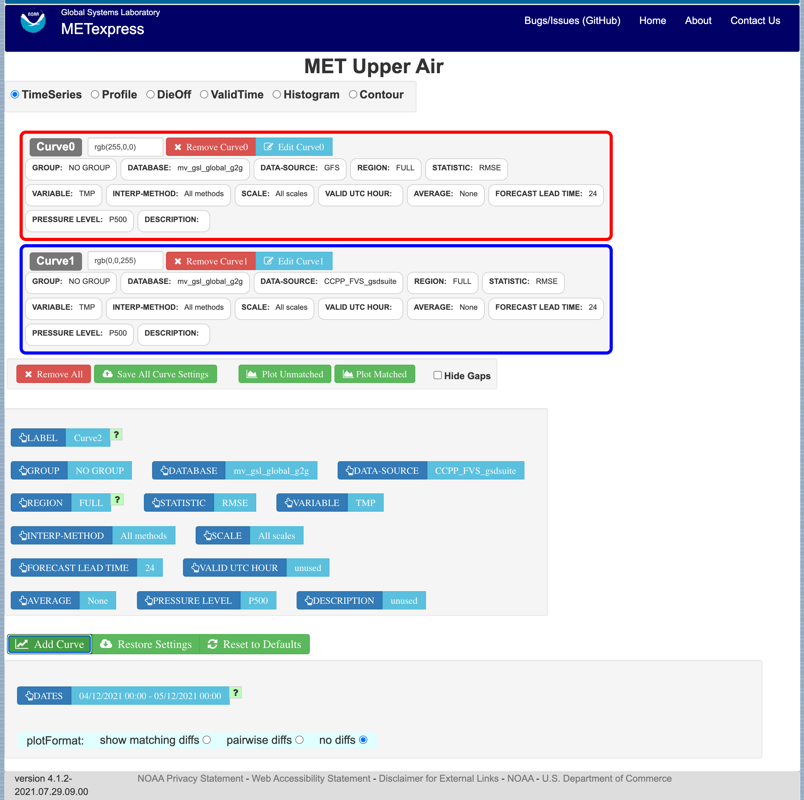
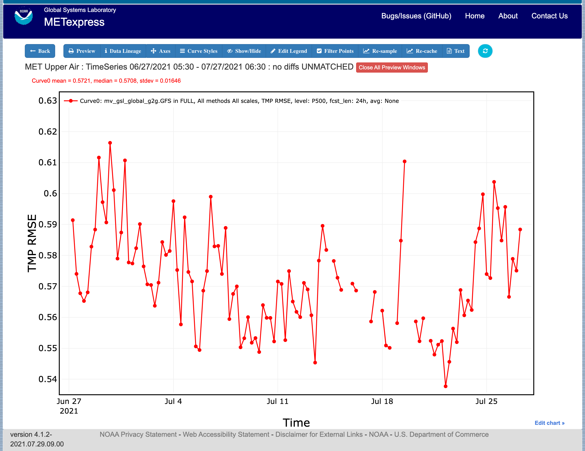
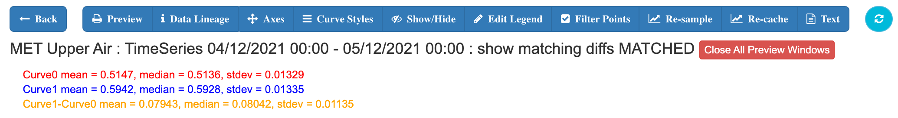

.. _interface:

General Interface Description
=============================

METexpress is a web space that includes various apps for specific purposes.
The current list of apps includes:

* MET Upper Air
* MET Anomaly Correlation
* MET Surface
* MET Air Quality
* MET Ensemble
* MET Precipitation
* MET Cyclone

Future development of METexpress is likely to add more apps.

Each app can have multiple plot types, such as time series and vertical
profiles.  The available plot types include those appropriate to each app.

Note that each app will have a similar layout for selecting parameters and
interacting with plots.  These general features are described in detail
here using the Upper Air app as an example.  Individual apps are then
described only in terms of their specific information and functionality.

Home Page
_________

The METexpress home page is shown in :numref:`interface_home_page`. The home page has a
button for each available app.  Each app lets the user create certain types
of plots for a certain type of data.  The user must begin by selecting the
app they want to use.

.. _interface_home_page:
 

	    
	    METexpress Home Page

User Interface Layout Common to Each App
________________________________________

The Upper Air app is used as an example here to describe the general layout
that is carried through on all apps.  The Upper Air user interface before any
curves have been defined is shown in :numref:`interface_upper_air_no_curve`. There are 3 parts to
this screen:

* Plot Type
* Curve Data Parameters 
* Plot Parameters
 
.. _interface_upper_air_no_curve:

	    Upper Air User Interface screen before any curves have been defined

After any curves have been added, the user interface screen includes a
fourth area, as shown in :numref:`interface_upper_air_curve0`, that shows what curves have already
been defined.  The section for the Curve Data Parameters then allows the
user to create additional curves to be added to the plot.
 
.. _interface_upper_air_curve0:

.. figure:: figure/interface_upper_air_curve0.png

	    Upper Air User Interface screen after Curve0 has been added,
	    showing the addition of the area for Defined Curves above the
	    Curve Data Parameters
 
Plot Types
__________

Immediately below the name of the app is a bar that allows selection of the
plot type.  Available types for Upper Air include Time Series, Profile,
DieOff, ValidTime, Histogram, and Contour.  Other apps include some plot
types specific to that application domain, such as Reliability plots in the
Ensemble app or GridScale plots in the Precip app.  The section for each
app below will describe the available plot types for that app.

The user will first want to decide what type of plot they want to produce
initially.  Most apps default to Time Series, but the user should change to
the type of plot they want to create.  If the plot type is changed after
curves have been defined, the user will be prompted whether to keep all
existing defined curves or to remove all the existing curves.

Curve Data Parameters
_____________________

In the central area of the screen is a box to define the data parameters
associated with each curve to be plotted.  Blue fields are selectors and
green fields are action buttons.

A default set of selections for each parameter (in blue boxes) will be shown,
which will define the data to be plotted.  The user can change any of these
selectors. The values available for most selectors depend on what data is
stored in the database, and on the values selected for other fields.  For
example if the DATA-SOURCE selected is GFS, the values available for REGION
will be only the regions that are stored in the database for GFS.

For these parameters there is a superior-dependent relationship.  For example
DATA-SOURCE (which is most typically the name of a model) is superior to
VARIABLE and REGION because only certain variables and regions are available
for a given DATA-SOURCE.  It is recommended that a user change parameters
starting at the top left and progressing across then down the page in
typical reading order.  This ordering generally keeps the superior-dependent
relationship intact.  If a dependent parameter is set and the superior
parameter is subsequently changed, the program attempts to maintain the
dependent parameter value if it is still available for the new superior
value.  If the dependent value is not available for the new superior then a
default value is automatically set for the dependent.  This maintains
consistency and prevents invalid parameter choices.

In the example Upper Air app, the selectable values are derived from the
data for these parameters:

* Group (as defined in the MET database)
* Database (name of user database)
* Data-Source (usually a model name)
* Region
* Statistic
* Variable
* Interp-Method
* Scale
* Forecast lead time
* Pressure level
* Description 
* Dates – date range that applies to all curves, used for plot types like time series
* Curve-dates – range of dates used to filter data for a particular curve, such as seen in vertical profiles, where each curve may potentially be based on data from different date ranges

Static fields
^^^^^^^^^^^^^

Some fields are not dependent on data.  In the Upper Air app, these are
Valid UTC Hour and Average, but these will vary for each app. Average
and Valid UTC Hour tend to have standardized choices available across many apps.

**Valid UTC Hour:**
This can be set to any whole number 0 to 23 for all of the apps.

**Average:**
If the value for AVERAGE is none, then all points available will be plotted.
Otherwise, all points in the selected interval are averaged into a single
value.  Available choices are as follows for all of the apps:

* None
* 1hr
* 3hr
* 6hr
* 12hr
* 1D
* 3D
* 7D
* 30D
* 60D
* 90D
* 180D

After selecting all data parameters as desired, the user would click the Add
Curve action button inside the green bar, and the area outlined in red in
:numref:`interface_upper_air_add_curve` would be added to show the parameters selected for Curve0.
The color for Curve0 has been given the default value of red and will also
be shown with a red line and/or symbols in the plot.  The color assigned to
this curve can be changed within the outlined box with the button labeled
“rgb(255,0,0)”.

Note that the user has the option to supply whatever label they prefer to use
for each curve, but the default is to create labels “Curve0”, “Curve1”, etc.

.. _interface_upper_air_add_curve:

	    Interface screen after defining a single curve with default
	    values, then selecting Add Curve

Editing a Curve
^^^^^^^^^^^^^^^

Once a curve is added, a user can go back and change any of
its parameters. There are two ways to do this: by clicking directly on the
selector value to be changed within the red outlined area, or by clicking
“Edit Curve” inside the red outline. The user would then set any selectors
to their updated values. If “Edit Curve” was used, or if the value of a
multi-select (a selector that can have multiple values chosen) was altered,
the user must finish the edit by clicking “Save Curve Changes”.

Defining Multiple Curves
^^^^^^^^^^^^^^^^^^^^^^^^

In :numref:`interface_upper_air_add_curve` “Curve0” has been
defined.  The user can then repeat the selection of curve data parameters
followed by Add Curve for as many curves as they wish to show on the plot.
Each new curve will be assigned a new color.  

An example of the interface screen with 2 curves defined is shown in
:numref:`interface_upper_air_two_curves` Curve0 data parameters are shown in the red box
and Curve1 data parameters are shown  in the blue box.

.. _interface_upper_air_two_curves:

	    Interface screen after defining 2 curves and selecting
	    Add Curve after each

Plot Parameters
_______________

The Plot Parameters appear in the box below the Curve Data Parameters box
and apply to all curves defined in the Curve Data Parameters.  The user
can select the dates to be included in the plot, plus the plotFormat.
Note that MATS also has an option to define QC parameters, but these are
not readily supported from the METviewer database.

The plotFormat defines whether or not to show differences between curves.
It has 3 options: “show matching diffs”, “pairwise diffs” or “no diffs”.

**Show matching diffs** takes the difference of each of the curves from Curve0.
For example, if a user had defined Curve0, Curve1, Curve2, and Curve3, and
selected "Show matching diffs", the plot would have three difference curves:
Curve1-Curve0, Curve2-Curve0, and Curve3-Curve0.

**Pairwise diffs** takes the difference of each pair of adjacent curves. So,
if a user had defined Curve0, Curve1, Curve2, and Curve3, and selected
"pairwise diffs", the plot would have two difference curves: Curve1-Curve0,
and Curve3-Curve2.

All difference curves calculate differences only where the data is matching.

**No diffs** is the default and will not include any difference curves in the
plot.

Saving and Restoring Settings
_____________________________

When all parameters have been set as desired – including curve data
parameters, plot parameters, and plot types - the user has an option to
Save All Curve Settings.  If selected, the user will be prompted to provide
a name for the saved settings.  In future the user has the option for
“Restore Settings”.  If selected, they will be prompted for the
saved-settings name.  After selecting saved-settings, all curve definitions,
plot parameters, and plot type will be reset from the saved-settings
definitions.

Generating a Plot
_________________

When the user is ready to generate a plot, the user would click either the
“Plot Unmatched” or the “Plot Matched” action button directly below the
outlined boxes with curve definitions.  

**Plot Unmatched** will plot points for all data available for each defined
curve.

**Plot Matched** will only plot points at x-axis values (y-axis for vertical
profiles) where data values exist for all defined curves. In addition, only
database values that exist at the same time period and same vertical level
for all defined curves will be considered when computing y-axis values
(x-axis for vertical profiles).

**Hide Gaps:** Note that when data points are missing, by default a line is
not shown connecting the surrounding points.  The user can force METexpress
to draw lines between points in all cases, by selecting Hide Gaps.

:numref:`interface_series_plot` shows the plot screen after the user selects Plot
Unmatched or Plot Matched with a single curve defined. The same curve
data as defined in :numref:`interface_series_plot` is used to generate the plot
in :numref:`interface_series_plot_hide_gaps`, but with Hide Gaps selected.

.. _interface_series_plot:

	    Plot of Time Series for a single curve with default values

.. _interface_series_plot_hide_gaps:

	    Same plot as shown in :numref:`interface_series_plot`, but with Hide Gaps
	    selected.
	    
:numref:`interface_series_plot_multiple` shows a sample plot with 2 curves: Curve0 and Curve1 in red and blue, and has also added a difference curve in yellow showing the difference between Curve0 and Curve1 and error bars on all curves.

.. _interface_series_plot_multiple:

	    Plot with Multiple Curves for Time Series, including Error Bars
	    and Difference Curves.  The yellow curve shows the
	    difference between the red and blue curves.

User controls on plot screen
____________________________

After the plot has been produced, the user can interact with the plot in
various ways.  For example, the user might want to focus on one particular
area of the plot to examine more detail, or the user might want to change
titles, line widths, etc to produce a plot suitable for publication.
:numref:`interface_plot_controls` highlights the tools available to interact with a plot.

.. _interface_plot_controls:

	    Detail of plot controls from figure above

The user can choose to dynamically zoom in and out on the plot.  In order
to zoom in on a plot, the user can click and drag a box over the area of
interest on the graph, and the zoom level will be automatically adjusted
to reflect the bounds of the box. To zoom back out, the user should double
click on the plot or click the blue refresh button to the far right the
dark blue toolbar.

METexpress plots are produced with the graphing package Plotly, and as
such inherit a suite of basic graph controls from Plotly. These tools
appear in the upper right corner of the plot when a user hovers their
cursor over the graph area. From left to right, the Plotly tools allow
a user to:

* Icon 1) Save a low-resolution PNG of the plot (METexpress has a separate
  capability to save high-resolution PNGs, as described below).
* Icons 2-3) Toggle between clicking to zoom (default) and clicking to pan.
* Icons 4-5) Toggle between using a box to zoom or pan (default) and using
  a lasso.
* Icons 6-7) Zoom in or out while maintaining the current center point of
  the graph.
* Icon 8) Have Plotly guess what the appropriate zoom level is to best
  frame the plot contents.
* Icon 9) Reset the x- and y- axes to their original zoom and pan settings.
* Icon 10) Turn on/off lines that trace the cursor’s position on the x-
  and y- axes.
* Icons 11-12) Toggle between only displaying the data tooltip when the
  cursor is over a point (default), or always displaying the nearest
  tooltip to the user.
* Icon 13) Visit Plotly’s website.

Beyond the inherited Plotly controls, a number of buttons on the plot
screen allow the user to interact with the displayed plot.

The **Back** button will return the user to the main app page, where the
curve parameters were defined.  This would allow the user to modify the
plot definitions and re-plot.

The **Preview** button will copy the interactive plot into a separate window,
to store it for comparison with future plots. The plot preview window
also has the functionality to save each plot as a PDF or PNG.

The **Data Lineage** button displays all of the plot parameters, data queries,
point values, and other metadata in a JSON format.

The **Axes** button allows users to customize the plot axes.  This includes
options to change the x- and y-axis limits, labels, label font sizes,
and tick font sizes, as well as the plot legend font size and font color,
and the grid line weight and color. These modifications all occur instantly,
without the user having to regenerate the plot.

The **Y Linear/Log** button appears for profile plots, and allows users to
toggle between having a linear vertical scale (the default), and a
logarithmic one.

The **Equi-space X** button appears for threshold plots, and allows users to
toggle between having a linear x-axis scale (the default), and equally
spacing all of the returned threshold values.

The **Curve Styles** button allows users to customize the appearance of the
curves in the plot. Here, users can change each curve’s color, line style,
line weight, marker style, and marker weight.

The **Colorbar** button appears for contour plots, and allows users to
customize the appearance of the contours. Here, users can change the
colorbar label, colorbar range, colorbar stride, colormap being used,
the direction of the chosen colormap (normal or reversed), and whether
to interpolate over any null points in the graph.

The **Show/Hide** button allows users to show/hide individual curves, the
markers on individual curves, the error bars on individual curves (if
applicable), the bars of individual histograms (if plotting histograms),
the mean/median/stdev annotation corresponding to individual curves, and
the entry for each curve in the plot legend.

The **Edit Legend** button allows users to customize the legend text for each
curve. By default, the legend displays the curve label, followed by each
of the curve parameters contributing to that plot trace.

The **Filter Points** button allows users to hide certain points on the graph,
for quality control, to increase the time interval between each point, etc.
Users uncheck independent variable values that they wish to hide when the
Filter Points Modal appears.

The **Re-sample** button allows users to change the zoom level of the x-axis
and then re-query the database with the new x-axis limits. This has two
advantages. Firstly, if the user initially asked for too narrow a time
period on a time series, they can increase the x-axis limits to their new
time range of interest, click the Re-sample button, and receive a new plot
with the full time range, all without having to return to the main app
page. Secondly, if the user initially requested a large time period,
METexpress will downsample the returned data with the Largest Triangle
Three Buckets algorithm, in order to prevent huge datasets from slowing
down the user’s web browser. The user can zoom in on a time period of
interest, click Re-sample, and receive the full, un-downsampled dataset
for that smaller time range.

The **Re-cache** button forces METexpress to re-query the database in the event
of new data being ingested. For the most part, METexpress will cache
requested plots for eight hours, and if another user requests the identical
curve/plot parameters within that eight hours, METexpress will return its
cached plot, instead of re-generating it. Re-cache forces it to actually
re-retrieve the data from the database and remake the plot.

The **Text** button changes from the plot page to a text page, which displays
all of the data on the graph in tables, along with statistics relating to
each point, as shown in :numref:`interface_text_screen` for the plot in
:numref:`interface_series_plot_multiple`. These
data tables can be exported as CSV files by clicking the “Export” button
at the top (next to the “Data Lineage” button), so that users have the
option of creating their own plots from the queried data.

.. _interface_text_screen:

	    Beginning of text screen for plot in :numref:`interface_series_plot_multiple`
    
The **blue refresh** button to the right of the text button will reset the
graph to its original pan and zoom settings, as well as reverting
any customization that the user has done to the axes or curves.

**Tool-tips**: On the graph itself, each point on each curve has an interactive
tool-tip. When a user mouses over a point, the tool-tip pops up, providing
details about that point’s x- and y-value and statistics.

**Error bars**: When the user clicks the “Plot Matched” action button instead
of “Plot Unmatched”, the points on the graphs will display error bars,
which are useful for comparing multiple curves. It should be noted,
however, that error bars will not display if each point only has one
database value contributing to it, as error bars are based on standard
deviation, and the standard deviation of one value is zero.
 
