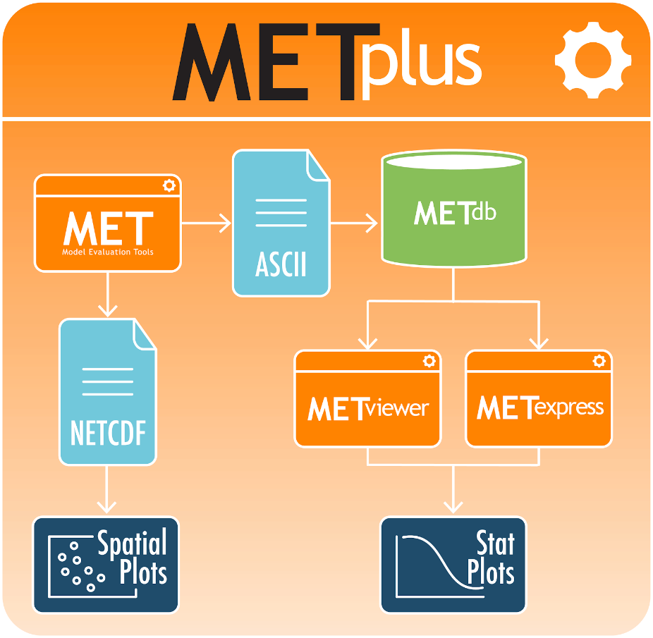

.. _Overview:

Overview of METexpress
======================

The METplus suite
_________________

METexpress is an easy-to-use interface that displays plots of statistical
verification metrics for the data that a user defines interactively.
The foundational metrics must first be generated from model output and
“truth” data (usually observations or gridded model analyses) produced by
the MET verification tool and the output files produced by MET must then be
loaded into a MET database.  It allows a model developer to explore metrics
about their model runs quickly and flexibly without relying on someone else
producing pre-generated plots.  The developer can slice and dice data in the
way that best gives them insight into how their model performed.

METexpress is one component of the METplus verification tool suite, which is
created and managed by the Developmental Testbed Center (DTC) and is the
official verification tool for NOAA’s Unified Forecast System.
:numref:`overview_image001` shows a graphic of the entire METplus package
and how METexpress integrates with the other tools.

.. _overview_image001:

            Schematic diagram of the structure of METplus, including METexpress

In the simplest workflow for verifying model outputs, the model output data
and “truth” or observation data are input into the MET software package which
outputs statistical information in an ASCII format.  That statistical
information is then read into and stored in the METdatadb database using
the METdbload tool.  METexpress allows the user to specify various parameters
for the plot they want to create and then queries the database to get the
relevant information and creates a plot.

METexpress Features
___________________

METviewer performs a similar functionality of querying the database and
producing a plot.  However, METviewer has a lot more flexibility and many
options that the user must know to specify, with the result that it requires
more training to fully understand it and use it effectively and accurately.
METexpress provides an alternative simplified, more intuitive interface,
which guides the user through selection of parameters needed in order to
produce a given type of plot.  The expectation is that METviewer would be
used by expert users who understand its extensive capabilities and advanced
features, but that METexpress would provide an interface for users to quickly
generate commonly used plots without having to gain the expertise needed to
run METviewer.  METexpress guides the user to define each parameter that is
needed to produce a given type of plot, with default parameter values
available also. 

METexpress was developed at NOAA/OAR Global Systems Laboratory (GSL) based
on a verification system developed in-house at GSL named the Model Analysis
Tool Suite, or MATS.  METexpress uses the basic framework of MATS but it
has been modified to work with the METplus database.

It is very important to understand that METexpress can only produce plots
based on the data that has been loaded into the METdatadb database.

The verification measures or statistics produced by METexpress follow
definitions set by the MET package with input from the mathematical expertise
within the Developmental Testbed Center (DTC).  To learn more about the
metrics and how to interpret them, please see the
`MET User Guide, <https://dtcenter.github.io/MET/Users_Guide/index.html>`_
particularly `Appendix C <https://dtcenter.github.io/MET/Users_Guide/appendixC.html>`_ about Verification Measures and additional material.

One of the features of METexpress is that, generally, it only presents the
user with choices for data parameters that are valid for the data sets that
the user has selected.  For example, if the user selects the model “GFS”,
the choices available for “variable” will be only the variables that have
been loaded into the database for the GFS model.  In this way, the user will
not go through the process to select variables, heights, statistics, etc
that don’t exist in the database and cannot be plotted.  This is achieved in
the interface by creating metadata (data that describes the data) in the
database that describe the available parameters for each data set.  The
generation of metadata will be discussed later. 
 
